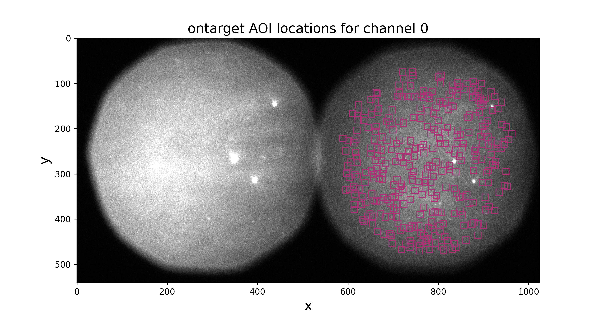
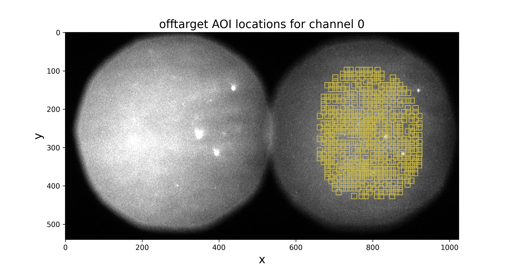
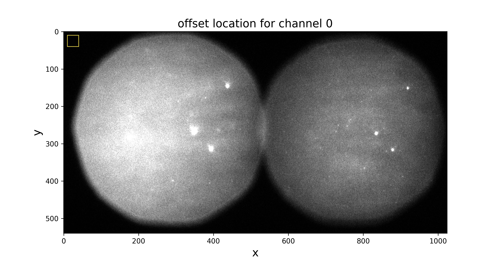

Part I: Tapqir analysis
=======================

Intro
-----

This tutorial shows you how to use Tapqir program and its commands, step by step. As an example we will
use the data from Rpb1-SNAP\ :sup:`549` binding to DNA\ :sup:`488` experiment (`Rosen GA et. al.`_).

We will analyze the data using the single-color time-independent colocalization model ``cosmos``.
Please checkout our preprint (`Ordabayev YA et. al.`_) to familiarize yourself with the model.

Set up the environment
----------------------

1. If Tapqir is not installed, please follow these :doc:`instructions </install/linux>` to do so.

2. Open the terminal. Tapqir is a command-line application and we will run all the commands in the terminal.

3. Activate the virtual environment (e.g., if named ``tapqir-env``)::

   $ conda activate tapqir-env

Create & initialize Tapqir analysis folder
------------------------------------------

To start the analysis create an empty folder (here named ``Rpb1SNAP549``) and initialize it by running
``tapqir init`` inside the new folder::

  $ mkdir Rpb1SNAP549
  $ cd Rpb1SNAP549
  $ tapqir init

  Tapqir is a Bayesian program for single-molecule data analysis.
  ---------------------------------------------------------------
  - Checkout the documentation: <https://tapqir.readthedocs.io/>
  - Get help on our forum: <https://github.com/gelles-brandeis/tapqir/discussions>
  - Star us on GitHub: <https://github.com/gelles-brandeis/tapqir>

  Initialized Tapqir in the working directory.

``tapqir init`` command has created a ``.tapqir`` sub-folder that will store internal files
such as ``config.yml`` configuration file, ``loginfo`` logging file, and model checkpoints.

Preprocessing raw input data
----------------------------

In this tutorial we will analyze the data from Rpb1-SNAP binding to DNA experiment (`Rosen GA et. al.`_).

This data was acquired with `Glimpse`_ and pre-processed with `imscroll`_ program (`Friedman LJ et. al.`_).
Let's download data files using `wget`_ and then unzip files::

  $ wget http://centaur.biochem.brandeis.edu/Rpb1SNAP549_glimpse.zip
  $ unzip Rpb1SNAP549_glimpse.zip && rm Rpb1SNAP549_glimpse.zip
  $ ls Rpb1SNAP549_glimpse

  garosen00267  green_DNA_locations.dat  green_driftlist.dat  green_nonDNA_locations.dat

The raw input data are:

* ``garosen00267`` - folder containing image data in glimpse format and header files
* ``green_DNA_locations.dat`` - aoiinfo file designating target molecule (DNA) locations in the binder channel
* ``green_nonDNA_locations.dat`` - aoiinfo file designating off-target (nonDNA) locations in the binder channel
* ``green_driftlist.dat`` - driftlist file recording the stage movement that took place during the experiment

Extract AOIs from raw images using ``tapqir glimpse`` command which will run interactively::

  $ tapqir glimpse

  Dataset name: Rpb1SNAP549
  AOI image size - number of pixels along the axis: 14
  Number of color channels: 1
  Overwrite defaults values? [Y/n]:
  Specify frame range? [y/N]: y
  First frame to include in the analysis: 1
  Last frame to include in the analysis: 790

  INPUTS FOR CHANNEL #0

  Channel name: SNAP549
  Path to the header/glimpse folder: Rpb1SNAP549_glimpse/garosen00267
  Path to the on-target AOI locations file: Rpb1SNAP549_glimpse/green_DNA_locations.dat
  Add off-target AOI locations? [y/N]: y
  Path to the off-target control AOI locations file: Rpb1SNAP549_glimpse/green_nonDNA_locations.dat
  Path to the driftlist file: Rpb1SNAP549_glimpse/green_driftlist.dat
  INFO - Processing glimpse files ...
  100%|███████████████████████████████████████████████████████████████████████| 790/790 [00:07<00:00, 105.28it/s]
  INFO - On-target data: N=331 AOIs, F=790 frames, C=1 channels, P=14 pixels, P=14 pixels
  INFO - Off-target data: N=526 AOIs, F=790 frames, C=1 channels, P=14 pixels, P=14 pixels
  INFO - Data is saved in /tmp/Rpb1SNAP549/data.tpqr

.. note::

   At the prompt enter a new value by typing and then hitting ENTER. To use a default value shown in ``[]``
   brackets press ENTER. For yes/no prompts type ``y`` for yes and ``n`` for no and then hit ENTER.
   The default for yes/no prompt is shown in capital.

.. note::

   Options default values are saved (if you select overwrite default values) in ``.tapqir/config.yml`` file in `YAML`_ format.

.. note::

   In Python indexing starts with 0. We stick to this convention and index AOIs, frames, color channels, and
   pixels starting with 0.

Apart from files above mentioned we also specified a dataset name (``Rpb1SNAP549``), size of AOI images (we recommend to
use ``14`` pixels), first and last frames included in the analysis (``1`` and ``790``), and the number of color channels (``1``).
If starting and ending frames are not specified then the full range of frames from the driftlist file will be analyzed.

The program has outputted ``data.tpqr`` file containing extracted AOIs, target
and off-target control locations, empirical offset distirbution samples and weights::

    $ ls

    data.tpqr            offset-distribution.png  ontarget-channel0.png
    offset-channel0.png  offtarget-channel0.png   Rpb1SNAP549_glimpse

Additionally the program has saved field of view (FOV) images displaying locations of on-target and off-target AOIs in the first frame,
location from the dark corner of the image used to create the offset empirical distribution, and the offset empirical distribution histogram.
Make sure that AOIs are *inside* of the FOV and offset is *outside* of the FOV.

.. image:: offset-distribution.png
   :width: 300

.. _Rosen GA et. al.: https://dx.doi.org/10.1073/pnas.2011224117
.. _Ordabayev YA et. al.: https://doi.org/10.1101/2021.09.30.462536 
.. _Friedman LJ et. al.: https://dx.doi.org/10.1016/j.ymeth.2015.05.026
.. _Glimpse: https://github.com/gelles-brandeis/Glimpse
.. _imscroll: https://github.com/gelles-brandeis/CoSMoS_Analysis/wiki
.. _wget: https://www.gnu.org/software/wget/
.. _YAML: https://docs.ansible.com/ansible/latest/reference_appendices/YAMLSyntax.html
