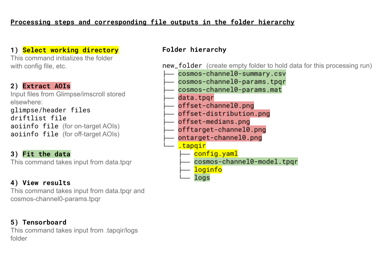

Part I: Intro (Generic)
=======================

Models
------

Tapqir is a modular program that uses a chosen probabilistic model to interpret experimental data.
There currently exists only a single model, ``cosmos``, developed for analysis of simple CoSMoS
experiments. The ``cosmos`` model is for *time-independent* analysis of *single-channel* (i.e., one-binder)
data sets. Our preprint (`Ordabayev et al., 2021`_) contains a comprehensive description of the
``cosmos`` model. In the future, we plan to add addional models to Tapqir, for example to integrate
hidden-Markov kinetic analysis or to handle global analysis with multiple wavelength channels.

Tapqir uses *Bayesian* models; this means that each model parameter has an associated probability
distribution (uncertainty). For those who are interested, `Kinz-Thompson et al., 2021`_ is
a nice read about Bayesian inference in the context of single-molecule data analysis.

As a consequence of Bayesian inference, Tapqir computes for each frame of each AOI the *probability*
:math:`p(\mathsf{specific})`, that a target-specific spot is present.

``cosmos`` is a physics-informed model, i.e. model parameters have a physical meaning.
For *N* AOIs per frame, *F* frames, and a maximum of *K* spots in each AOI in each frame, 
Tapqir estimates the values of the ``cosmos`` model parameters:

+-----------------+-----------+-------------------------------------+
| Parameter       | Shape     | Description                         |
+=================+===========+=====================================+
| |g| - :math:`g` | (1,)      | camera gain                         |
+-----------------+-----------+-------------------------------------+
| |sigma| - |prox|| (1,)      | proximity                           |
+-----------------+-----------+-------------------------------------+
| ``lamda`` - |ld|| (1,)      | average rate of target-nonspecific  |
|                 |           | binding                             |
+-----------------+-----------+-------------------------------------+
| ``pi`` - |pi|   | (1,)      | average binding probability of      |
|                 |           | target-specific binding             |
+-----------------+-----------+-------------------------------------+
| |bg| - |b|      | (N, F)    | background intensity                |
+-----------------+-----------+-------------------------------------+
| |z| - :math:`z` | (N, F)    | target-specific spot presence       |
+-----------------+-----------+-------------------------------------+
| |t| - |theta|   | (N, F)    | target-specific spot index          |
+-----------------+-----------+-------------------------------------+
| |m| - :math:`m` | (K, N, F) | spot presence indicator             |
+-----------------+-----------+-------------------------------------+
| |h| - :math:`h` | (K, N, F) | spot intensity                      |
+-----------------+-----------+-------------------------------------+
| |w| - :math:`w` | (K, N, F) | spot width                          |
+-----------------+-----------+-------------------------------------+
| |x| - :math:`x` | (K, N, F) | spot position on x-axis             |
+-----------------+-----------+-------------------------------------+
| |y| - :math:`y` | (K, N, F) | spot position on y-axis             |
+-----------------+-----------+-------------------------------------+
| |D| - :math:`D` | |shape|   | observed images                     |
+-----------------+-----------+-------------------------------------+

.. |ps| replace:: :math:`p(\mathsf{specific})`
.. |theta| replace:: :math:`\theta`
.. |prox| replace:: :math:`\sigma^{xy}`
.. |ld| replace:: :math:`\lambda`
.. |b| replace:: :math:`b`
.. |shape| replace:: (N, F, P, P)
.. |sigma| replace:: ``proximity``
.. |bg| replace:: ``background``
.. |h| replace:: ``height``
.. |w| replace:: ``width``
.. |D| replace:: ``data``
.. |m| replace:: ``m``
.. |z| replace:: ``z``
.. |t| replace:: ``theta``
.. |x| replace:: ``x``
.. |y| replace:: ``y``
.. |pi| replace:: :math:`\pi`
.. |g| replace:: ``gain``

where "shape" is the dimensionality of the parameters, e.g., (1,) shape means a scalar
parameter and (K, N, F) shape means that *each* spot in *each* AOI in *each* frame
has a separate value of the parameter. `Ordabayev et al., 2021`_ has a more detailed
description of the parameters.

The Tapqir command line interface is implemented in `Typer`_.

Interface
---------

Tapqir is a command-line application that runs in the terminal (``$`` signifies a terminal prompt in
the information below). The usage is ``tapqir COMMAND [OPTIONS]``. For example::

    $ tapqir fit --model cosmos --cuda

where 

* ``tapqir`` is the *program*.
* ``fit`` is the *command*.
* ``--model cosmos`` is a command *option (flag)* where ``--model`` is the option name and ``cosmos`` is the option value.
* ``--cuda`` is a Yes or No command *option (flag)* where its value is True/Yes if provided and False/No if not provided.

Some options have a short version (with one dash) as well. For example, both ``--help`` and ``-h`` will display help.

``tapqir --help`` will display an overall help and ``tapqir COMMAND --help`` will display
a command-specific help that will show which options are available for that specific command.

Commands have the following meanings:

+------------------------+-----------------------------------+
| Command                | Short description                 |
+========================+===================================+
| | ``$ tapqir init``    | Initialize folder                 |
+------------------------+-----------------------------------+
| | ``$ tapqir glimpse`` | Extract AOIs                      |
+------------------------+-----------------------------------+
| | ``$ tapqir fit``     | Fit the data                      |
+------------------------+-----------------------------------+
| | ``$ tapqir stats``   | Calculate parameter uncertainties |
+------------------------+-----------------------------------+
| | ``$ tapqir show``    | Visualize results                 |
+------------------------+-----------------------------------+
| | ``$ tapqir log``     | Show logging info                 |
+------------------------+-----------------------------------+

Command *options* do not depend on their order. For command options that require specifying a value
that are not provided ``tapqir`` will interactively ask for the missing value::

    Tapqir model [cosmos]: cosmos

At the prompt, enter a new value by typing and then hit ENTER. To use a default value shown in ``[...]``
brackets, just press ENTER. For yes/no prompts type ``y`` for yes and ``n`` for no and then hit ENTER.
The default for yes/no prompt is shown in capital::

    Run computations on GPU? [Y/n]: y

Default option values are read from the ``.tapqir/config.yml`` configuration file (`YAML`_ format file).
When the command is run it will ask to overwrite default values (or use ``--overwrite`` flag).

To disablle all prompts use a ``--no-input`` flag (e.g., ``tapqir fit --no-input``).
This is useful after the first invocation of the command when the option values have been saved and you
want to re-run the command with the same option values.

To summarize:

1. If provided, the option value is accepted from the command line as a flag.
2. If not provided, the prompt will ask for the missing option value.
3. To disable all prompts use the ``--no-input`` flag. The program will first look for command flags and then
   for default values from the configuration file. If the required option value is missing the program will
   fail and ask to pass the information as a flag.

To escape the program use ``Ctrl-C``.

Some basic Linux commands
^^^^^^^^^^^^^^^^^^^^^^^^^

For a quick reference, some commonly used Linux commands:

1. ``pwd`` - Print the name of the current working directory.
2. ``ls`` - List files and folders.
3. ``cd`` - Change the working directory (e.g., ``cd Downloads``)
4. ``mkdir`` - Create a folder (e.g., ``mkdir new_folder``). Tip: try to avoid spaces in file & folder
   names because spaces need a special escape character ``\``.
5. ``rm`` - Delete files. Use ``rm -r`` to delete folders. Be careful, files delted with ``rm`` command
   do not go to the recycle bin and are permanently deleted!
6. ``cp`` - Copy files. Usage is ``cp <from> <to>``.
7. ``mv`` - Move or rename files. Usage is ``mv <from> <to>``.
8. Use double ``[TAB]`` for command or filename completion.

Input data
----------

Tapqir analyzes a small area of interest (AOI) around each target or off-target location. AOIs (usually ``14x14`` pixels)
are extracted from raw input data. Currently Tapqir supports raw input images in `Glimpse`_ format and pre-processing
information files from the `imscroll`_ program:

* image data folder in glimpse format (contains glimpse.header file)
* aoiinfo file designating the locations of target molecules (on-target AOIs) in the binder channel
* (optional) aoiinfo file designating the off-target control locations (off-target AOIs) in the binder channel
* driftlist file recording the stage movement that took place during the experiment

We plan to extend the support to other data formats. Please start a `new issue`_ if you would like to work with us 
to extend support to file formats used in your processing pipeline.

Workflow
--------

The following diagram shows the steps in a Tapqir data processing run (using the ``cosmos`` model), the Tapqir command
used to run each step, and the input files used and output files produced (color highlights) in each step. All the
Tapqir commands for a single processing run should be run in the same default working directory (``new_folder`` in
the diagram) in order to keep the files associated with the run organized in a single location.

.. _Ordabayev et al., 2021: https://doi.org/10.1101/2021.09.30.462536 
.. _Kinz-Thompson et al., 2021: https://doi.org/10.1146/annurev-biophys-082120-103921
.. _Bingham et al., 2019: https://jmlr.org/papers/v20/18-403.html
.. _Typer: https://typer.tiangolo.com/
.. _YAML: https://docs.ansible.com/ansible/latest/reference_appendices/YAMLSyntax.html
.. _Glimpse: https://github.com/gelles-brandeis/Glimpse
.. _imscroll: https://github.com/gelles-brandeis/CoSMoS_Analysis/wiki
.. _new issue: https://github.com/gelles-brandeis/tapqir/issues/new/choose
