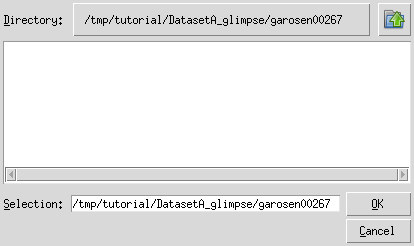
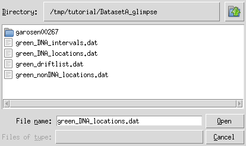

Part II: Tapqir analysis (Linux)
================================

In this tutorial we will use a linux computer to analyze the Data set A in `Ordabayev et al., 2021`_. The data
are taken from `Rosen et al., 2020`_ and have already been preprocesssed using `imscroll`_ (`Friedman et al., 2015`_).

Set up the environment
----------------------

1. If Tapqir is not installed, please follow these :doc:`instructions </install/linux>` to do so.

2. Open the terminal. Tapqir is a command-line application and we will run all the commands in the terminal.

3. Activate the virtual environment (e.g., if named ``tapqir-env``)::

   $ conda activate tapqir-env

Initialize folder
-----------------

To start the analysis create an empty folder (here named ``tutorial``) and initialize it by running
``tapqir init`` inside the new folder::

  $ mkdir tutorial
  $ cd tutorial
  $ tapqir init

  Initialized Tapqir in the working directory.
  ---------------------------------------------------------------
  - Checkout the documentation: <https://tapqir.readthedocs.io/>
  - Get help on our forum: <https://github.com/gelles-brandeis/tapqir/discussions>

``tapqir init`` command has created a ``.tapqir`` sub-folder that will store internal files
such as ``config.yml`` configuration file, ``loginfo`` logging file, and model checkpoints.

Download input data
-------------------

This data was acquired with `Glimpse`_ and pre-processed with `imscroll`_ program (`Friedman et al., 2015`_).
Let's download data files using `wget`_ and then unzip files::

  $ wget https://zenodo.org/record/5659927/files/DatasetA_glimpse.zip
  $ unzip DatasetA_glimpse.zip && rm DatasetA_glimpse.zip

The raw input data are:

* ``garosen00267`` - folder containing image data in glimpse format and header files
* ``green_DNA_locations.dat`` - aoiinfo file designating target molecule (DNA) locations in the binder channel
* ``green_nonDNA_locations.dat`` - aoiinfo file designating off-target (nonDNA) locations in the binder channel
* ``green_driftlist.dat`` - driftlist file recording the stage movement that took place during the experiment

Extract AOIs
------------

Extract AOIs from raw images using ``tapqir glimpse --filepicker`` command (``--filepicker`` flag tells
the program to use a file dialog for file/folder selection) which will run interactively::

  $ tapqir glimpse --filepicker

  Dataset name: Rpb1SNAP549
  AOI image size - number of pixels along the axis [14]:
  Number of color channels [1]:
  Overwrite defaults values? [Y/n]:
  Specify frame range? [y/N]: y
  First frame to include in the analysis: 1
  Last frame to include in the analysis: 790

Above we specified a dataset name (``Rpb1SNAP549``), size of AOI images (we recommend to use ``14`` pixels),
first and last frames included in the analysis (``1`` and ``790``), and the number of color channels (``1``).
If starting and ending frames are not specified then the full range of frames from the driftlist file will be analyzed.

Next, the program asks the locations of input files for each color channel (only one color channel in this example):

.. note::

   In Python indexing starts with 0. We stick to this convention and index AOIs, frames, color channels, and
   pixels starting with 0.

.. code-block::

  INPUTS FOR CHANNEL #0

  Channel name: SNAP549
  Path to the header/glimpse folder:
  /tmp/tutorial/DatasetA_glimpse/garosen00267

.. code-block::

  Path to the on-target AOI locations file:
  /tmp/tutorial/DatasetA_glimpse/green_DNA_locations.dat

.. code-block::

  Add off-target AOI locations? [y/N]: y
  Path to the off-target control AOI locations file:
  /tmp/tutorial/DatasetA_glimpse/green_nonDNA_locations.dat
  Path to the driftlist file:
  /tmp/tutorial/DatasetA_glimpse/green_driftlist.dat

Above we tell the program to include off-target AOI locations in the analysis and specify the file location using
the file dialog. Last, we specify the location of the driftlist file.

.. code-block::

  INFO - Processing glimpse files ...
  100%|███████████████████████████████████| 790/790 [00:07<00:00, 109.28it/s]
  INFO - Dataset: N=857 AOIs, F=790 frames, C=1 channels, P=14 pixels, P=14 pixels
  INFO - Data is saved in /tmp/tutorial/data.tpqr

The program has outputted ``data.tpqr`` file containing extracted AOIs, target and
off-target control locations, the camera offset empirical distirbution samples and weights::

    $ ls

    data.tpqr            offset-distribution.png  ontarget-channel0.png
    offset-channel0.png  offtarget-channel0.png   DatasetA_glimpse

Additionally the program has saved

* field of view (FOV) images (``ontarget-channel0.png`` and ``offtarget-channel0.png``)
  displaying locations of on-target and off-target AOIs in the first frame (make sure that AOIs are *inside* of the FOV):

.. image:: ontarget-channel0.png
   :width: 700

.. image:: offtarget-channel0.png
   :width: 700

* Location from the dark corner of the image (``off-channel0.png``) used to create the offset empirical distribution
  (make sure that offset region is *outside* of the FOV):

.. image:: offset-channel0.png
   :width: 700

* The intensity distribution histograms for offset and data from different channels (``offset-distribution.png``):

.. image:: offset-distribution.png
   :width: 300

* Offset median drift (offset distribution shouldn't change over time) (``offset-medians.png``):

.. image:: offset-medians.png
   :width: 500

Fit the data
------------

Now the data is ready for analysis. We will first fit the data to the time-independent ``cosmos`` model (`Ordabayev et al., 2021`_).

.. note::
   We use variational inference to fit the model. For a better convergence we marginalize out :math:`\theta` parameter
   in the model ("marginalization" is a term in Bayesian inference meaning integrating out the variable). This is what
   we call the marginal (``--marginal``) model. However, to calculate :math:`p(\mathsf{specific})` we need the probability values
   of :math:`\theta` parameter. Therefore, at the second step we fit the "full" model where :math:`\theta` is not marginalized
   out. At this step we also "freeze" all other parameters since they already have converged to a good value. In short,
   we first need to fit the "marginal" model and then the "full" model.

First, fit the data to the ``cosmos`` model with :math:`\theta` marginalized out (``--marginal``)::

    $ tapqir fit

    Tapqir model (cosmos) [cosmos]:
    Channel numbers (space separated if multiple) [0]:
    Use the marginalized model? [y/n]: y
    Run computations on GPU? [y/n]: y
    AOI batch size [10]:
    Frame batch size [512]:
    Learning rate [0.005]:
    Number of epochs [0]:
    Overwrite defaults values? [Y/n]:
    INFO - Tapqir version - 0+untagged.779.gd3fba72.dirty
    INFO - Model - cosmos
    INFO - Device - cuda
    INFO - Floating precision - torch.float64
    INFO - Loaded data from /tmp/tutorial/data.tpqr
    INFO - Optimizer - Adam
    INFO - Learning rate - 0.005
    INFO - AOI batch size - 5
    INFO - Frame batch size - 512
      0%|                                             | 0/1000 [00:00<?, ?it/s]

Options that we selected:

* Model - the default single-color time-independent model (``cosmos``).

* Color channel number - first chanel (``0``) (there is only one color channel in this data)

* Marginalized model - yes (``y``).

* Run computations on GPU: yes (``y``).

* AOI batch size - use default (``10``).

* Frame batch size - use default (``512``).

* Learning rate - use default (``0.005``).

* Number of epochs - use default (``0``)

.. note::
   **About batch size**. In theory, batch size should impact *training time* and *memory consumption*,
   but not the *performance*. It can be optimized for a particular GPU hardware by
   trying different batch size values and comparing training time/memory usage
   (``nvidia-smi`` shell command shows Memory-Usage and GPU-Util values). In particular,
   if there is a memory overflow you can decrease either AOI batch size (e.g., to ``5``)
   or frame batch size (e.g., to ``128`` or ``256``).

.. note::
   **About epoch**. Sweep through the entire data set is called an *epoch*. Fitting the data
   requires many epochs (about 500-1000) until parameters converge. Setting the number of epochs to 0 will run
   the program till Tapqir's custom convergence criteria is satisfied. We recommend to set it
   to 0 (default) and then run for additional number of epochs as required. Convergence of global
   parameters can be visually checked using tensorboard_.

The program will save a checkpoint every epoch (checkpoint is saved at ``.tapqir/cosmos-channel0-model.tpqr``).
Starting the program again will resume from the last saved checkpoint. The program can be stopped using ``Ctrl+C``.
At every checkpoint the values of global variational parameters (``-ELBO``, ``gain_loc``, ``proximity_loc``,
``pi_mean``, ``lamda_loc``) are also recorded for visualization by tensorboard_. Plateaued plots signify convergence.

After the marginalized model has converged run the full ``cosmos`` model (usually
100-150 epochs is enough)::

    $ tapqir fit

    Use the marginalized model? [Y/n]: n
    Run computations on GPU? [Y/n]:
    AOI batch size [10]:
    Frame batch size [512]:
    Learning rate [0.005]:
    Number of epochs [0]: 100
    Overwrite defaults values? [Y/n]:
    INFO - Tapqir version - 0+untagged.779.gd3fba72.dirty
    INFO - Model - cosmos
    INFO - Device - cuda
    INFO - Floating precision - torch.float64
    INFO - Loaded data from /tmp/tutorial/data.tpqr
    INFO - Epoch #391. Loaded model params and optimizer state from /tmp/tutorial/.tapqir
    INFO - Optimizer - Adam
    INFO - Learning rate - 0.005
    INFO - AOI batch size - 10
    INFO - Frame batch size - 512
     40%|██████████████                     | 40/100 [49:32<1:14:12, 74.21s/it]

.. tip::

    Use ``CUDA_VISIBLE_DEVICES`` environment variable to change CUDA device::

        $ CUDA_VISIBLE_DEVICES=1 tapqir fit ...

    To view available devices run::

        $ nvidia-smi

Tensorboard
^^^^^^^^^^^

Fitting progress can be inspected while fitting is taking place or afterwards using `tensorboard program <https://www.tensorflow.org/tensorboard>`_::

    $ tensorboard --logdir=.

Posterior distributions
^^^^^^^^^^^^^^^^^^^^^^^

To compute 95% credible intervals of model parameters run::

    $ tapqir stats

    Tapqir model (cosmos) [cosmos]:
    Channel numbers (space separated if multiple) [0]:
    Run computations on GPU? [Y/n]:
    AOI batch size [10]:
    Frame batch size [512]:
    Save parameters in matlab format? [y/N]: y
    INFO - Tapqir version - 0+untagged.779.gd3fba72.dirty
    INFO - Model - cosmos
    INFO - Device - cuda
    INFO - Floating precision - torch.float64
    INFO - Loaded data from /tmp/tutorial/data.tpqr

Options:

* Save parameters in matlab format - yes (``y``)

Parameters with their mean value, 95% CI (credible interval) lower limit and upper limit
are saved in ``cosmos-channel0-params.tqpr``, ``cosmos-channel0-params.mat``, and ``cosmos-channel0-summary.csv`` files.

To visualize analysis results run::

    $ tapqir show

which will open GUI displaying parameter values (mean and 95% CI). Clicking on the ``Images`` button
will show original images along with the best fit estimates.

Viewing logging info
--------------------

Tapqir logs console output to a ``.tapqir/loginfo`` text file. It can be viewed by running::

    $ tapqir log

.. _Rosen et al., 2020: https://dx.doi.org/10.1073/pnas.2011224117
.. _Ordabayev et al., 2021: https://doi.org/10.1101/2021.09.30.462536 
.. _Friedman et al., 2015: https://dx.doi.org/10.1016/j.ymeth.2015.05.026
.. _Glimpse: https://github.com/gelles-brandeis/Glimpse
.. _imscroll: https://github.com/gelles-brandeis/CoSMoS_Analysis/wiki
.. _wget: https://www.gnu.org/software/wget/
.. _YAML: https://docs.ansible.com/ansible/latest/reference_appendices/YAMLSyntax.html
