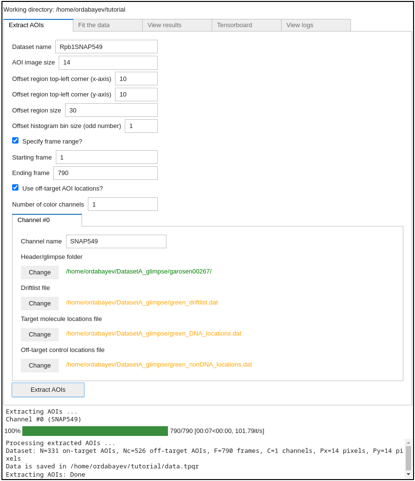
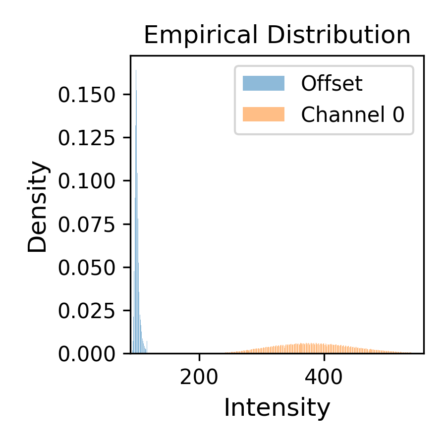

Part II: Tapqir analysis (Linux/Windows)
========================================

In this tutorial we will use a linux computer to analyze the Data set A in `Ordabayev et al., 2022`_. The data
are taken from `Rosen et al., 2020`_ and have already been preprocesssed using `imscroll`_ (`Friedman et al., 2015`_).

Set up the environment
----------------------

1. If Tapqir is not installed, please follow these instructions for :doc:`Linux </install/linux>`
   or :doc:`Windows </install/windows>` system to do so.

2. Open the terminal and activate the virtual environment (e.g., if named ``tapqir-env``)::

   $ conda activate tapqir-env

Download input data
-------------------

These data were acquired with `Glimpse`_ and pre-processed with the `imscroll`_ program (`Friedman et al., 2015`_).
Change directory to user's home directory::

  $ cd ~

Download data files using `wget`_::

  $ wget https://zenodo.org/record/5659927/files/DatasetA_glimpse.zip

Unzip and then delete the zip file::

  $ unzip DatasetA_glimpse.zip && rm DatasetA_glimpse.zip

The raw input data placed in ``/home/{your_username}/DatasetA_glimpse`` are:

* ``garosen00267`` - folder containing image data in glimpse format and header files
* ``green_DNA_locations.dat`` - aoiinfo file designating target molecule (DNA) locations in the binder channel
* ``green_nonDNA_locations.dat`` - aoiinfo file designating off-target (nonDNA) locations in the binder channel
* ``green_driftlist.dat`` - driftlist file recording the stage movement that took place during the experiment

To start the analysis create an empty folder (here named ``tutorial``) which will be the working directory::

  $ mkdir ~/tutorial

Start the program
-----------------

To start the program run::

  $ tapqir-gui

which will open a browser window to display the Tapqir GUI:

.. figure:: start-page.png
   :width: 800

Select working directory
------------------------

Click the ``Select`` button to set the working directory  to ``/home/{your_username}/tutorial``:

.. figure:: working-directory.png
   :width: 800

Setting working directory creates a ``.tapqir`` sub-folder that will store internal files
such as ``config.yaml`` configuration file, ``loginfo`` logging file, and model checkpoints.

Extract AOIs
------------

To extract AOIs specify the following options in the ``Extract AOIs`` tab:

* A dataset name: ``Rpb1SNAP549`` (an arbitrary name)
* Size of AOI images: we recommend using ``14`` pixels
* Starting and ending frame numbers to be included in the analysis (``1`` and ``790``). If starting and ending frames are not specified
  then the full range of frames from the driftlist file will be analyzed.
* The number of color channels: ``1`` (this data set has only one color channel available)
* Use off-target AOI locations?: ``True`` (we recommended including off-target AOI locations in the analysis)

And specify the locations of input files for each color channel (only one color channel in this example):

* Channel name: ``SNAP549`` (an arbitrary name)
* Header/glimpse folder: ``/home/{your_username}/DatasetA_glimpse/garosen00267``
* Driftlist file: ``/home/{your_username}/DatasetA_glimpse/green_driftlist.dat``
* Target molecule locations file: ``/home/{your_username}/DatasetA_glimpse/green_DNA_locations.dat``
* Off-target control locations file: ``/home/{your_username}/DatasetA_glimpse/green_nonDNA_locations.dat``

See Advanced settings below for details on adjusting offset parameters.

.. note::

   **About indexing**. In Python indexing starts with 0. We stick to this convention and index AOIs, frames, color channels,
   and pixels starting with 0. Note, however, that for starting and ending frame numbers we used ``1`` and ``790`` which are according to
   Matlab indexing convention (in Matlab indexing starts with 1) since driftlist file was produced using a Matlab script.

Next, click ``Extract AOIs`` button:

Great! The program has outputted a ``data.tpqr`` file containing extracted AOI images (N=331 target and Nc=526 off-target
control locations)::

    $ ls ~/tutorial

    data.tpqr            offset-distribution.png  offtarget-channel0.png
    offset-channel0.png  offset-medians.png       ontarget-channel0.png

Additionally, the program has saved

* Image files (``ontarget-channel0.png`` and ``offtarget-channel0.png``) displaying locations of on-target and off-target
  AOIs in the first frame. You should inspect these images to make sure that AOIs are *inside* the field of view:

.. figure:: ontarget-channel0.png
   :width: 700

.. figure:: offtarget-channel0.png
   :width: 700

* You should also look at ``offset-channel0.png`` to check that offset data is taken from a region *outside* the field of view:

.. figure:: offset-channel0.png
   :width: 700

* The other two files show the intensity histograms (``offset-distribution.png``) and the offset median time record
  (``offset-medians.png``) (offset distribution shouldn't drift over time):

.. figure:: offset-medians.png
   :width: 500

Fit the data
------------

Now the data is ready for fitting. Options that we will select:

* Model - the default single-color time-independent ``cosmos`` model (`Ordabayev et al., 2022`_).
* Color channel number - first chanel (``0``) (there is only one color channel in this data)
* Run computations on GPU: yes (``True``).
* AOI batch size - use default (``10``).
* Frame batch size - use default (``512``).
* Learning rate - use default (``0.005``).
* Number of iterations - use default (``0``)

See Advanced settings below for details on adjusting prior parameters.

.. note::
   **About batch size**. Batch sizes should impact *training time* and *memory consumption*. Ideally,
   it should not affect the final result. Batch sizes can be optimized for a particular GPU hardware by
   trying different batch size values and comparing training time/memory usage
   (``nvidia-smi`` shell command shows Memory-Usage and GPU-Util values).

Next, press ``Fit the data`` button:

The program will automatically save a checkpoint every 200 iterations (checkpoint is saved at ``.tapqir/cosmos_model.tpqr``).
The program can be stopped at any time by clicking in the *terminal window* and pressing ``Ctrl-C``. To restart the program again re-run
``tapqir-gui`` command and the program will resume from the last saved checkpoint.

After fitting is finished, the program computes 95% credible intervals (CI) of model parameters and saves the parameters and CIs in
``cosmos_params.tqpr``, ``cosmos_params.mat`` (if Matlab format is selected), and ``cosmos_summary.csv`` files.

If you get an error message saying that there is a memory overflow you can decrease either frame batch size (e.g., to ``128`` or ``256``)
or AOI batch size (e.g., to ``5``).

Tensorboard
-----------

At every checkpoint the values of global variational parameters (``-ELBO``, ``gain_loc``, ``proximity_loc``,
``pi_mean``, ``lamda_loc``) are recorded. Fitting progress can be inspected while fitting is taking place or afterwards with the `tensorboard program <https://www.tensorflow.org/tensorboard>`_
displayed in the ``Tensorboard`` tab, which shows the parameters values as a function of iteration number:

.. note::

   On WSL the Tensorboard tab does not work. To view tensorboard open a new terminal, activate the environment::

      $ conda activate tapqir-env

   run tensorboard::

      $ tensorboard --logdir=<your working directory>

   and then open localhost port (typically ``http://localhost:6006``) in a browser window. To quit tensorboard press ``Ctrl-C``.

.. tip::

   Set smoothing to 0 (in the left panel) and use refresh button at the top right to refresh plots.

Plateaued plots of ``-ELBO``, ``gain_loc``, ``proximity_loc``, ``pi_mean``, and ``lamda_loc`` signify convergence.

.. note::

   **About number of iterations**. Fitting the data requires many iterations (about 50,000-100,000) until parameters
   converge. Setting the number of iterations to 0 will run the program till Tapqir's custom convergence criterion is satisfied.
   We recommend to set it to 0 (default) and then run for additional number of iterations if required.

View results
------------

After fitting is done open ``View results`` tab to visualize analysis results. Click on ``Load results`` button which will display parameter values
from the ``cosmos_params.tpqr`` file:

.. note::

   ``cosmos_params.tpqr`` file is generated after fitting has completed (either when specified number of iterations has finished or
   the model has converged).

.. note::

   If ``Show FOV images`` is checked then the image of the entire field of view will be displayed at the bottom. Note, however,
   that raw glimpse files as specified at AOI extraction step need to be present on the local disk.

.. figure:: view-results.png
   :width: 800

In the display panel:

* the top row shows raw images and the second row shows best fit images
* target-specific spot presence probability ``p(specific)`` and its most likely value ``z``
* values (mean and 95% CI) of ``h``, ``w``, ``x``, ``y``, and ``b`` parameters for target-specific spot (green) and
  target-nonspecific spots (spot 1 is blue and spot 2 is orange; remember that spot numbering is arbitrary)
* chi-squared test of how well the model fits each particular image (higher number means worse fit)

The AOI number can be changed using the box widget or ``Down``, ``Up`` arrow keys or ``j``, ``k`` keys
(hover the mouse over the ``View results`` tab for keys to work).

Frame range can be toggled to zoom out to entire frame range by clicking on the ``Zoom out frames`` checkbox
or using the ``z`` key. When zoomed out the range of frames corresponding to AOI images is highlighted in blue.

The frame range can be changed by using the slider widget at the top or ``Left``, ``Right`` arrow keys or ``h``, ``l``
keys or by left-clicking on the plot.

Advanced settings
-----------------

Offset
^^^^^^

Offset data region (yellow square) can be edited using three variables:

* ``offset_x``: left corner of the square (default is 10 pixels)
* ``offset_y``: top corner of the square (default is 10 pixels)
* ``offset_P``: size of the square (default is 30 pixels)

Bin size for the offset intensity histogram by default is 1. The bin size can be increased (try 3 or 5; odd number)
to make the histogram sparser which will speed up fitting.

* ``bin_size``: offset intensity histogram bin size (default is 1)

Prior distributions
^^^^^^^^^^^^^^^^^^^

Parameters of prior distirbutions (Eqs. 6a, 6b, 11, 12, 13, 15, and 16 in `Ordabayev et al., 2022`_):

* ``background_mean_std`` (default 1000): standard deviation of the HalfNormal distribution in Eq. 6a
* ``background_std_std`` (default 100): standard deviation of the HalfNormal distribution in Eq. 6b
* ``lamda_rate`` (default 1): rate parameter of the Exponential distribution in Eq. 11
* ``heiht_std`` (default 10,000): standard deviation of the HalfNormal distribution in Eq. 12
* ``width_min`` (default 0.75): minimum value of Uniform distribution in Eq. 13
* ``width_max`` (default 2.25): maximum value of Uniform distribution in Eq. 13
* ``proximity_rate`` (default 1): rate parameter of the Exponential distribution in Eq. 15
* ``gain_std`` (default 50): standard deviation of the HalfNormal distribution in Eq. 16

.. _Rosen et al., 2020: https://dx.doi.org/10.1073/pnas.2011224117
.. _Ordabayev et al., 2022: https://doi.org/10.7554/eLife.73860
.. _Friedman et al., 2015: https://dx.doi.org/10.1016/j.ymeth.2015.05.026
.. _Glimpse: https://github.com/gelles-brandeis/Glimpse
.. _imscroll: https://github.com/gelles-brandeis/CoSMoS_Analysis/wiki
.. _wget: https://www.gnu.org/software/wget/
.. _YAML: https://docs.ansible.com/ansible/latest/reference_appendices/YAMLSyntax.html
