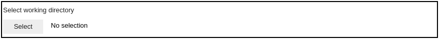
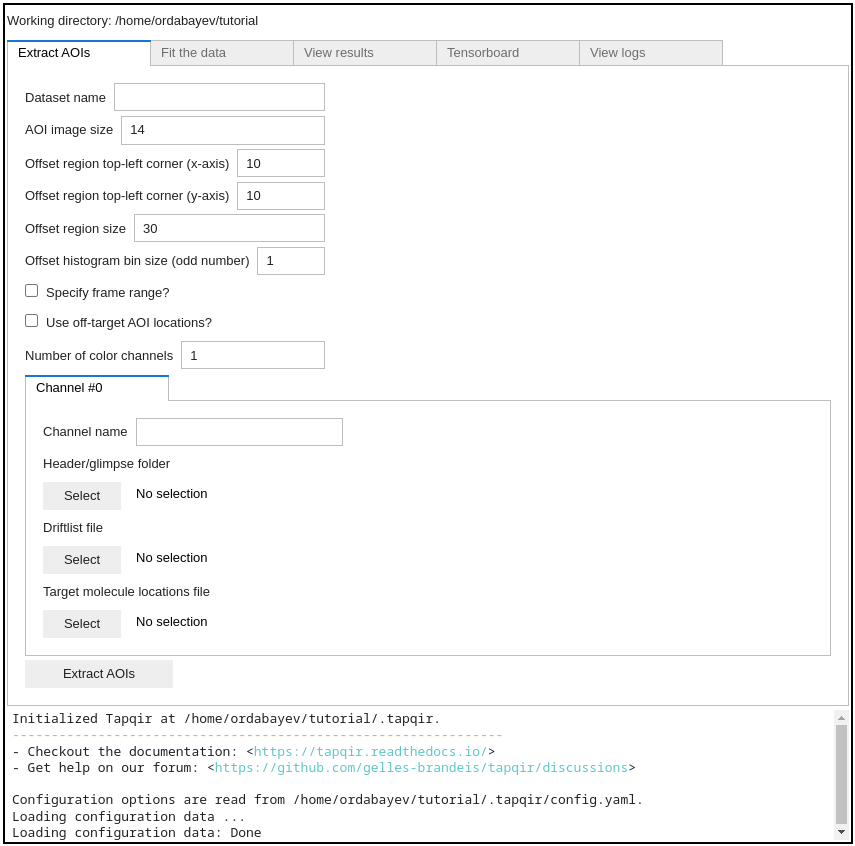
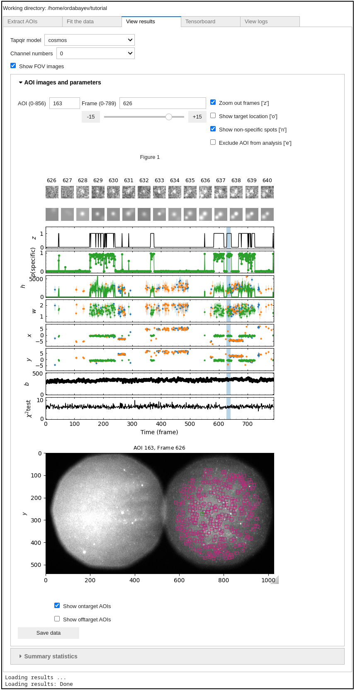

Part II: Tapqir analysis (Linux)
================================

In this tutorial we will use a linux computer to analyze the Data set A in `Ordabayev et al., 2021`_. The data
are taken from `Rosen et al., 2020`_ and have already been preprocesssed using `imscroll`_ (`Friedman et al., 2015`_).

Set up the environment
----------------------

1. If Tapqir is not installed, please follow these :doc:`instructions </install/linux>` to do so.

2. Open the terminal and activate the virtual environment (e.g., if named ``tapqir-env``)::

   $ conda activate tapqir-env

To start the analysis create an empty folder (here named ``tutorial``) which will be the working directory::

  $ mkdir /tmp/tutorial
  $ cd /tmp/tutorial

Download input data
-------------------

This data was acquired with `Glimpse`_ and pre-processed with `imscroll`_ program (`Friedman et al., 2015`_).
Let's download data files using `wget`_ and then unzip files::

  $ wget https://zenodo.org/record/5659927/files/DatasetA_glimpse.zip
  $ unzip DatasetA_glimpse.zip && rm DatasetA_glimpse.zip

The raw input data are:

* ``garosen00267`` - folder containing image data in glimpse format and header files
* ``green_DNA_locations.dat`` - aoiinfo file designating target molecule (DNA) locations in the binder channel
* ``green_nonDNA_locations.dat`` - aoiinfo file designating off-target (nonDNA) locations in the binder channel
* ``green_driftlist.dat`` - driftlist file recording the stage movement that took place during the experiment

Start the program
-----------------

To start the GUI program run::

  $ tapqir-gui

which will open a web application at `<http://localhost:8866>`_.

Select working directory
------------------------

Set the working directory at ``/tmp/tutorial``:

Setting working directory has created a ``.tapqir`` sub-folder that will store internal files
such as ``config.yaml`` configuration file, ``loginfo`` logging file, and model checkpoints.

Extract AOIs
------------

To extract AOIs specify the following options in the ``Extract AOIs`` tab:

* A dataset name:``Rpb1SNAP549`` (an arbitrary name)
* Size of AOI images: we recommend to use ``14`` pixels
* First and last frames included in the analysis (``1`` and ``790``). If starting and ending frames are not specified
  then the full range of frames from the driftlist file will be analyzed.
* The number of color channels: ``1``
* Use off-target AOI locations?: ``True`` (it is recommended to include off-target AOI locations in the analysis)

And specify the locations of input files for each color channel (only one color channel in this example):

* Channel name: ``SNAP549`` (an arbitrary name)
* Header/glimpse folder: ``/tmp/tutorial/DatasetA_glimpse/garosen00267``
* Target molecule locations file: ``/tmp/tutorial/DatasetA_glimpse/green_DNA_locations.dat``
* Off-target control locations file: ``/tmp/tutorial/DatasetA_glimpse/green_nonDNA_locations.dat``
* Driftlist file: ``/tmp/tutorial/DatasetA_glimpse/green_driftlist.dat``

.. note::

   **About indexing**. In Python indexing starts with 0. We stick to this convention and index AOIs, frames, color channels,
   and pixels starting with 0. Note, however, that for frame numbers we used ``1`` and ``790`` which are according to
   Matlab indexing convention (in Matlab indexing starts with ``1``) since driftlist file was produced using the Matlab script.

And click ``Extract AOIs`` button:

.. image:: extract-aois.png
   :width: 700

Great! The program has outputted ``data.tpqr`` file containing extracted AOI images (N=331 target and Nc=526 off-target
control locations), the camera offset empirical distirbution sample values and their weights::

    $ ls

    DatasetA_glimpse     offset-distribution.png  ontarget-channel0.png
    data.tpqr            offset-medians.png
    offset-channel0.png  offtarget-channel0.png

Additionally, the program has saved

* Image files (``ontarget-channel0.png`` and ``offtarget-channel0.png``) displaying locations of on-target and off-target
  AOIs in the first frame (make sure that AOIs are *inside* the FOV):

.. image:: ontarget-channel0.png
   :width: 700

.. image:: offtarget-channel0.png
   :width: 700

* Location from the dark corner of the image (``offset-channel0.png``) used to create the offset empirical distribution
  (make sure that offset region is *outside* the FOV):

.. image:: offset-channel0.png
   :width: 700

* The intensity distribution histograms for offset and data from different channels (``offset-distribution.png``):

.. image:: offset-distribution.png
   :width: 300

* Offset median change (offset distribution shouldn't drift over time) (``offset-medians.png``):

Fit the data
------------

Now the data is ready for fitting. Options that we will select:

* Model - the default single-color time-independent ``cosmos`` model (`Ordabayev et al., 2021`_).
* Color channel number - first chanel (``0``) (there is only one color channel in this data)
* Run computations on GPU: yes (``True``).
* AOI batch size - use default (``10``).
* Frame batch size - use default (``512``).
* Learning rate - use default (``0.005``).
* Number of iterations - use default (``0``)

.. note::
   **About batch size**. In theory, batch size should impact *training time* and *memory consumption*,
   but not the *performance*. It can be optimized for a particular GPU hardware by
   trying different batch size values and comparing training time/memory usage
   (``nvidia-smi`` shell command shows Memory-Usage and GPU-Util values). In particular,
   if there is a memory overflow you can decrease either frame batch size (e.g., to ``128`` or ``256``)
   or AOI batch size (e.g., to ``5``).

.. note::
   **About number of iterations**. Fitting the data requires many iterations (about 50,000-100,000) until parameters
   converge. Setting the number of iterations to 0 will run the program till Tapqir's custom convergence criteria is satisfied.
   We recommend to set it to 0 (default) and then run for additional number of iterations if required. Convergence of global
   parameters can be visually checked in the Tensorboard tab.

Press ``Fit the data`` button:

.. image:: fit-data.png
   :width: 700

The program will save a checkpoint every 200 iterations (checkpoint is saved at ``.tapqir/cosmos-channel0-model.tpqr``).
Starting the program again will resume from the last saved checkpoint. The program can be stopped using ``Ctrl-C`` in the terminal.
At every checkpoint the values of global variational parameters (``-ELBO``, ``gain_loc``, ``proximity_loc``,
``pi_mean``, ``lamda_loc``) are also recorded for visualization by tensorboard_. Plateaued plots signify convergence.

After fitting is finished the program computes 95% credible intervals of model parameters and saves them in
``cosmos-channel0-params.tqpr``, ``cosmos-channel0-params.mat`` (in Matlab format if selected), and ``cosmos-channel0-summary.csv`` files.

Tensorboard
-----------

Fitting progress can be inspected while fitting is taking place or afterwards with the `tensorboard program <https://www.tensorflow.org/tensorboard>`_
displayed in the Tensorboard tab:

.. image:: tensorboard-tab.png
   :width: 800

Set smoothing to 0 (in left panel) and use refresh button at the top right to refresh plots.

View results
------------

After fitting is done open ``View results`` tab to visualize analysis results. Click on ``Load results`` button which will display parameter values
from ``cosmos-channel0-params.tpqr`` file:

In the display panel, top row shows raw images, second row shows best fit images, plots show ``p(specific)`` and parameter values (mean and 95% CI).
AOI number and frame range can be changed using widgets at the top.

.. tip::

    Use ``CUDA_VISIBLE_DEVICES`` environment variable to change CUDA device::

        $ CUDA_VISIBLE_DEVICES=1 tapqir-gui

    To view available devices run::

        $ nvidia-smi

.. _Rosen et al., 2020: https://dx.doi.org/10.1073/pnas.2011224117
.. _Ordabayev et al., 2021: https://doi.org/10.1101/2021.09.30.462536
.. _Friedman et al., 2015: https://dx.doi.org/10.1016/j.ymeth.2015.05.026
.. _Glimpse: https://github.com/gelles-brandeis/Glimpse
.. _imscroll: https://github.com/gelles-brandeis/CoSMoS_Analysis/wiki
.. _wget: https://www.gnu.org/software/wget/
.. _YAML: https://docs.ansible.com/ansible/latest/reference_appendices/YAMLSyntax.html
