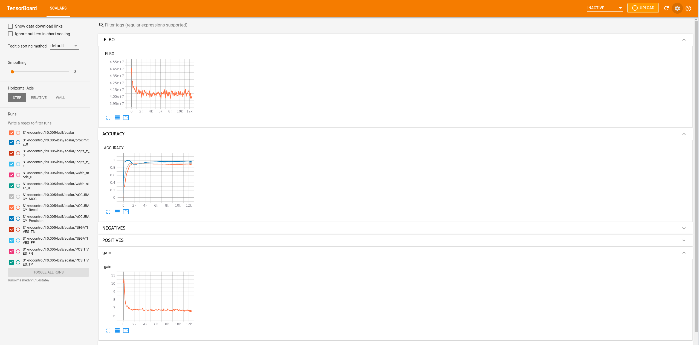
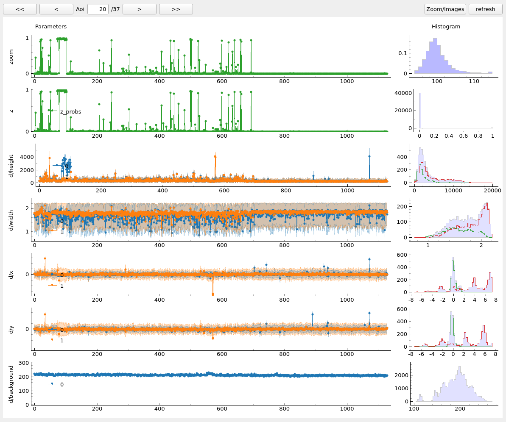
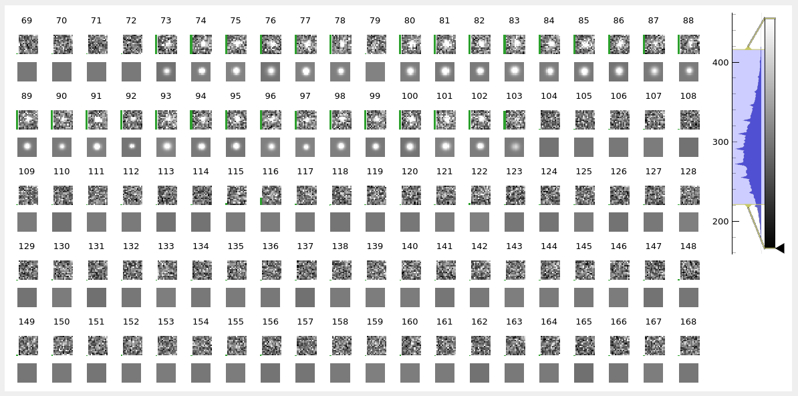

.. _usage:

Usage
=====

Create a configuration file
~~~~~~~~~~~~~~~~~~~~~~~~~~~

To begin the analysis first create an empty directory at ``dataset_path`` and run::

    tapqir config dataset_path

which will create a file named ``options.cfg`` containing command options.

.. note::

    ``dataset_path`` can be an absolute path or a relative path. For example, from
    inside of the created directory, the command can be run as :code:`tapqir config .`

Importing experimental data into **tapqir**
~~~~~~~~~~~~~~~~~~~~~~~~~~~~~~~~~~~~~~~~~~~

Data from glimpse/imscroll
--------------------------

Analyzing data acquired with `Glimpse <https://github.com/gelles-brandeis/Glimpse>`_ and pre-processed with 
the **imscroll** program (see `CoSMoS_Analysis <https://github.com/gelles-brandeis/CoSMoS_Analysis/wiki>`_)
will require the following files:

- image data folder in glimpse format
- aoiinfo file designating the areas of interest (aois) corresponfing to target molecules to be analyzed
- (optional) aoiinfo file designating the areas of interest corresponding to locations that do not contain target molecules  (negative control -- optional)
- driftlist file recording the stage movement that took place during the experiment

Enter the names of your folder/files under the ``[glimpse]`` section of the ``options.cfg`` file::

    [glimpse]
    dir = /home/ordabayev/Documents/Datasets/Grace_article_data/glimpse_sequence_for_Pol_II_and_Spt5/garosen00267
    test_aoiinfo = /home/ordabayev/Documents/Datasets/Grace_article_data/aoiinfo2_files_for_DNA_locations_in_cy5_and_cy3_fields/00267_fm1_green_mapped_corr_dnaaois.dat
    control_aoiinfo = /home/ordabayev/Documents/Datasets/Grace_article_data/aoiinfo2_files_for_nonDNA_locations_in_cy5_and_cy3/00267_green_mapped_corr_nondnaaois.dat
    driftlist = /home/ordabayev/Documents/Datasets/Grace_article_data/green_and_red_driftlists/b3p81_00267_green_driftlist__manual.dat
    frame_start =
    frame_end = 
    labels = 
    labeltype = 
    
(Leave ``frame_start``, ``frame_end``, ``labels`` and ``labeltype`` blank)

To import your data run::

    tapqir glimpse dataset_path
    
The program will create the files containing the digested data in the format needed for fitting:

- ``drift.csv`` contains drift list
- ``test_data.pt`` contains cropped images at target sites
- ``test_target.csv`` contains target site positions
- ``offset.pt`` contains cropped images of offset sites
- ``control_data.pt`` contains cropped images at dark sites
- ``control_target.csv`` contains dark site positions

Fit experimental data to a model
~~~~~~~~~~~~~~~~~~~~~~~~~~~~~~~~

To adjust fitting parameters edit ``[fit]`` section of the ``options.cfg`` file::

    [fit]
    num_states = 1
    k_max = 2
    num_iter = 30000
    infer = 10000
    batch_size = 5
    learning_rate = 0.005
    control = True
    device = cuda

Then run::

    tapqir fit cosmos dataset_path

.. note::

    To use different CUDA device run::

        CUDA_VISIBLE_DEVICES=1 tapqir fit cosmos dataset_path

Results
~~~~~~~

Output files of the analysis are saved in ``runs/model/version/S/control/learning-rate/batch-size/`` (``parameters_path``):

- ``params`` and ``optimizer`` are model parameters and optimizer state saved in PyTorch format
- ``global_params.csv`` contains values of global parameters
- ``parameters.mat`` contains MAP estimate of parameters in MATLAB format
- ``scalar`` folder containing global parameter values over iterations
- ``run.log`` log file

Tensorboard
-----------

Fitting progress saved in ``scalar`` can be visualized using tensorboard program::

    tensorboard --logdir=parameters_path

which will open the window in the browser:

Posterior Distributions
-----------------------

Posterior distributions of the local parameters can be visualized by running ``show`` command::

    tapqir show cosmos dataset_path parameters_path

which will display parameter values, original images along with best estimates:

