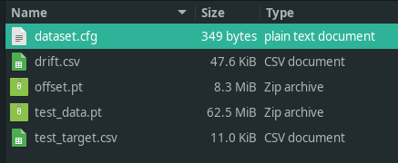

.. _usage:

Usage
=====

Importing experimental data into **cosmos**
~~~~~~~~~~~~~~~~~~~~~~~~~~~~~~~~~~~~~~~~~~~

Data from glimpse/imscroll
--------------------------

Analyzing data acquired with `Glimpse <https://github.com/gelles-brandeis/Glimpse>`_ and pre-processed with 
the **imscroll** program (see `CoSMoS_Analysis <https://github.com/gelles-brandeis/CoSMoS_Analysis/wiki>`_)
will require the following files:

* image data folder in glimpse format
* aoiinfo file designating the areas of interest (aois) corresponfing to target molecules to be analyzed
* (optional) aoiinfo file designating the areas of interest corresponding to locations that do not contain target molecules  (negative control)
* driftlist file recording the stage movement that took place during the experiment

To import the needed data from these files, make an empty directory and run::

    cosmos config pathname

which will create a file named **options.cfg** containing command options.
`[glimpse]` section contains the names of your folder/files::

    [glimpse]
    dir = /home/ordabayev/Documents/Datasets/Grace_article_data/glimpse_sequence_for_Pol_II_and_Spt5/garosen00267
    test_aoiinfo = /home/ordabayev/Documents/Datasets/Grace_article_data/aoiinfo2_files_for_DNA_locations_in_cy5_and_cy3_fields/00267_fm1_green_mapped_corr_dnaaois.dat
    control_aoiinfo = /home/ordabayev/Documents/Datasets/Grace_article_data/aoiinfo2_files_for_nonDNA_locations_in_cy5_and_cy3/00267_green_mapped_corr_nondnaaois.dat
    driftlist = /home/ordabayev/Documents/Datasets/Grace_article_data/green_and_red_driftlists/b3p81_00267_green_driftlist__manual.dat
    labels = 
    labeltype = 
    
(Ignore labels and labeltype for now.)

To import your data from inside the directory containing options.cfg, run::

    cosmos glimpse .
    
The program will create the files containing the digested data in the format needed for fitting:

Using **cosmos** to fit experimental data to a model
~~~~~~~~~~~~~~~~~~~~~~~~~~~~~~~~~~~~~~~~~~~~~~~~~~~~

Edit **options.cfg** file::

    cosmos fit tracker .

Set visible cuda devices::

    CUDA_VISIBLE_DEVICES=1 cosmos fit tracker .

Tensorboard
-----------

.. code-block:: bash

    tensorboard --logdir=runs/trackerv1.1.3/nocontrol/lr0.005/bs8/

cosmos show
-----------

.. code-block:: bash

    cosmos show tracker . runs/trackerv1.1.3/nocontrol/lr0.005/bs8/
